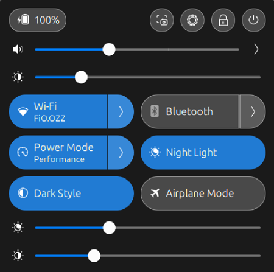

# Brightness & Night Light Sliders

GNOME Shell extension that adds brightness and Night Light sliders to Quick Settings.

<p align="center">
  
</p>

## Requirements

- GNOME 45, 46, or 47
- `ddcutil` installed and available in `PATH`
- External monitor with DDC/CI support (brightness slider won't work on laptop displays)

## Install

Clone once, then run the installer from inside the repo:

```bash
git clone https://github.com/MahmoudUwk/Brightness-Night-Light-Sliders.git && cd Brightness-Night-Light-Sliders && ./install.sh
```

## Reinstall / Update

Run the same command again from the existing repo:

```bash
./install.sh
```

Running `./install.sh` again removes the old version and installs the new one. If the repo is a git clone, the installer pulls the latest source first.

## Commands

```bash
./install.sh           # Install or reinstall
./install.sh status    # Check installation status
./install.sh uninstall # Remove
```

## Known Issues

### Brightness slider not working

- **Laptop displays**: Internal panels (eDP/LVDS/DSI) don't support DDC/CI. Only external monitors work.
- **No displays detected**: Run `ddcutil detect` to check if your monitor/dock/adapter supports DDC/CI.
- **ddcutil missing**: Install `ddcutil` first, then reinstall the extension.

### GNOME Shell crashes

This extension uses defensive programming to avoid crashes during monitor topology changes:
- Debounced monitor change handling (1 second settle time)
- Generation tokens to cancel stale async operations
- Monitor validity guards before applying changes

If you experience crashes:
1. Update your system: `sudo apt update && sudo apt full-upgrade -y && reboot`
2. Check logs: `journalctl -b | grep -iE "gnome-shell|mutter"`
3. Try X11 instead of Wayland (login screen -> gear icon -> "Ubuntu on Xorg")
4. Report an issue with the info below

## Troubleshooting

```bash
# Check if monitor supports DDC/CI
ddcutil detect

# Check extension logs
journalctl -b | grep -i BrightnessNightLightSliders

# Check installation status
./install.sh status
```

**Night Light slider not showing**

Enable Night Light in Settings > Displays > Night Light.

## Reporting Issues

When reporting issues, include:

1. **System info**:
   ```bash
   gnome-shell --version
   echo $XDG_SESSION_TYPE
   ./install.sh status
   ```

2. **Monitor setup**: Laptop? External monitor? Dock? Connection type (HDMI/DP/USB-C)?

3. **Logs**:
   ```bash
   journalctl -b | grep -iE "gnome-shell|mutter|BrightnessNightLightSliders" | tail -50
   ```

4. **Crash report** (if applicable):
   ```bash
   ls -la /var/crash/
   ```

## License

MIT
